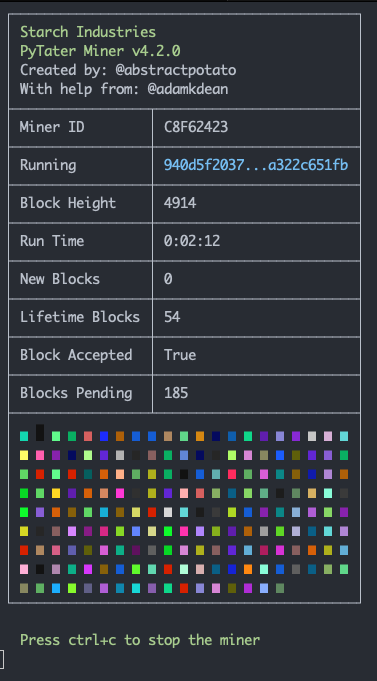

# PyTater

> Python Version: 3.9<br />
> Version: 4.2.0<br />
> Author: Adam K. Dean<br />
> License: Apache License 2.0

PyTater is a CLI-based $STRCH miner for the Starch Chain by Starch Industries.

For more information about starch chain, please read the [Starch Chain Manifesto](https://github.com/StarchIndustries/SIPs/blob/e75e1828105b5b716e57a1e905ac1bc88619bdef/MANIFESTO.md).

You can run the miner by cloning this repository to your local machine and executing the following commands and then you're off to the taters!

```shell
cd PyTater/
pip install -r requirements.txt
cd PyTater/
python3 PyTater.py -m <YOU_MINER_ID> -p
```


## Run as a Systemd service

Create a systemd unit file. Assumes user name is Ubuntu and path is /home/ubuntu/git/PyTater. Edit username and paths accordingly along with the miner id(after -m).

```shell
sudo nano /etc/systemd/system/starch-miner.service
```

```shell
[Unit]
Description=Starch Miner
After=network.target

[Service]
User=ubuntu
ExecStart=/usr/bin/python3 /home/ubuntu/git/PyTater/PyTater/PyTater.py -m C8F62423
Restart=always

[Install]
WantedBy=multi-user.target
```

Save (ctrl-o) and close (ctrl-x) the file, then make systemd aware of it.

```shell
sudo systemctl daemon-reload
```

Start the service and check it is running.

```shell
sudo systemctl start starch-miner.service
sudo systemctl status starch-miner.service
```

If it's running, enable systemd to start the miner when the system boots. If it isn't running skip the next step and check the service log for clues as to why

Remember if you edit the unit file you must 'sudo systemctl reload-daemon' afterwards for your changes to have effect. Once you have it starting up run the enable command so it starts when you reboot the machine. (ctrl+c) to exit status view!

```shell
sudo systemctl enable starch-miner.service
```

To watch PyTater's output follow the service unit with journalctl.

```shell
journalctl -o cat -u starch-miner -f
```
```shell
18:22:29: Loading potato goodness... Spudtacular moments are on the way!
18:22:29: Booting up anticipation... Get ready for a simmering sensation.
Enter your Miner ID: ABCD1234
18:23:02: Diving deep into the crypto potato mine... Extracting $STRCH gems with starchy precision.
18:23:02: Unearthing $STRCH treasures with potato prowess... Mining spudtastic crypto gold.
18:23:02: Block Height: 3915 (Hash: ca526cac5bfdf6a7d577d33380b9aaf525051919a4726bf062ebea12bf7ab89c, Color: #b2e560, Miner: 1C2C798F)
18:23:02: We should mine a block!
```

ctrl+c to exit journalctl!

If you want to see the 'pretty view' mode you can run a second copy of the miner simultaneously like.

```shell
python3 /home/ubuntu/git/PyTater/PyTater/PyTater.py -m C8F62423 -p
```